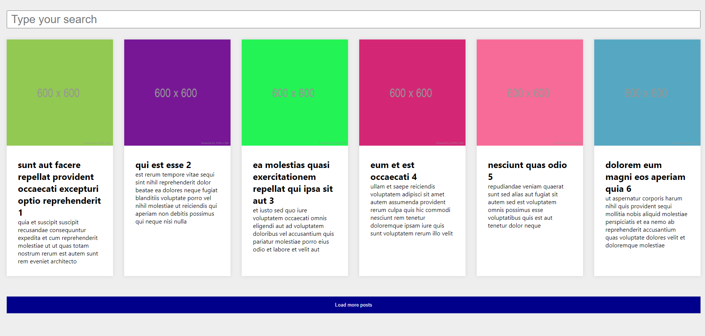

 <div align="center">
    <!-- LICENSE -->
    
    <!-- LAST COMMIT -->
    <a href="https://github.com/marcelo-rafael/react-basic/commits/master">
    
    </a>
    <!-- STARS -->
    <a href="https://github.com/marcelo-rafael/react-basic/stargazers/master">
    
    </a>
    <!-- FORKS -->
    <a href="https://github.com/marcelo-rafael/react-basic/forks/master">
    
    </a>
    <!-- AUTHOR -->
    
    <!-- LANGUAGES -->
    
    <!-- REPO SIZE -->
    
    <!-- CONTRIBUTORS -->
  
</div>

---

<h1 align="center">
React Blog
</h1>
<p align="center">Deployed <a href="https://react-blog-api.netlify.app/">here</a>.</p>

---

## :computer: About

Simple project to train basic react.js and build external API

The project was first created in class components using an API [JSONPlaceholder] (https://jsonplaceholder.typicode.com/) consuming two routes.
Then the project was migrated to function components with useState and useEffect and typed with the prop-types lib.
Then the unit tests of the components were done separately and finally left the complete page with its characteristics

---

## :computer:  Web/mobile

<h4 align="center">
  
</h4>

---

## :rocket: Tech Stack

The following tools were used in the construction of the project:

- **[React](https://pt-br.reactjs.org/)**
- **[Prop-Types](https://www.npmjs.com/package/prop-types)**
- **[Mock Service Worker](https://mswjs.io/)**
- **[Jest](https://jestjs.io/pt-BR/)**
- **[Testing library](https://testing-library.com/)**
- **[Prettier](https://prettier.io/)**
- **[EsLint](https://eslint.org/)**
- **[EditorConfig](https://editorconfig.org/)**

---

## 🚀 How to run the project

### Prerequisites

Have an editor to work with the code like [VSCode](https://code.visualstudio.com/)

---

## 👯 Cloning the repository

```bash
# Clone this repository
$ git clone https://github.com/marcelo-rafael/react-basic

# Access the project folder in the terminal/cmd
$ cd react-basic

```

### Running the Application

```bash
# install dependencies
$ yarn or npm install

# Run Application in Development
$ yarn dev or npm run start

# The application will open at port: 3000 - access http://localhost:3000
```

---

## 💪 How to contribute to the project
	  
1. 🍴 Fork the project.
2. 👯 Clone this repository to your machine.
3. 🎋 Create a new branch with your changes: `git checkout -b my-feature`
4. ✅ Save the changes and create a commit message telling you what you've done: `git commit -m "feature: My new feature"`
5. 📌 Submit your changes: `git push origin my-feature`
6. 🔃 Create a new pull request


Once your pull request has been merged, you can delete `your-feature`

> If you have any questions, check out this [GitHub Contribution Guide](https://github.com/firstcontributions/first-contributions)


---

## 🤓 Autor


<div>
<a href="mailto:marcelo.rafael.goncalves@gmail.com">
      
   </a>
<a href="https://www.linkedin.com/in/marcelo-rafael-gonçalves/">
      
   </a>
<a href="https://github.com/marcelo-rafael">
  
  </a>
</div>

---
	  
## 📝 LICENSE

This repository is licensed under the **MIT LICENSE**. For more detailed information, read the [LICENSE](./LICENSE) file contained in this repository.

<h3 align="center">
Made with ❤️ by <a href="https://www.linkedin.com/in/marcelo-rafael-goncalves/">Marcelo Rafael Gonçalves 💜🚀</a>
</h3>
	 

